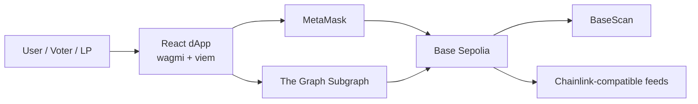
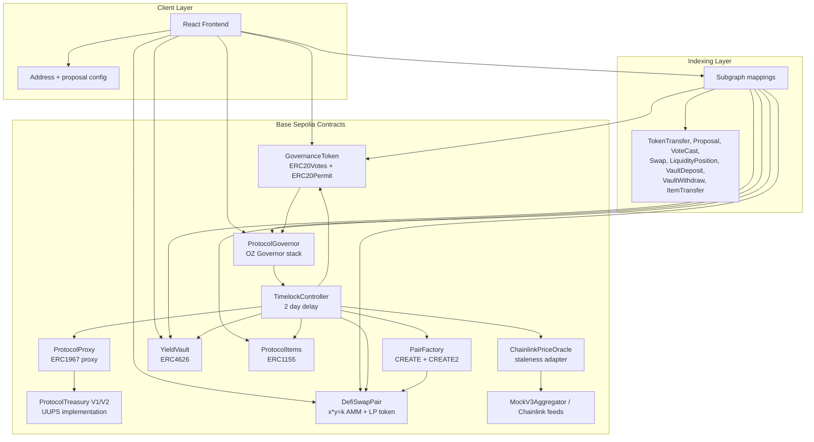
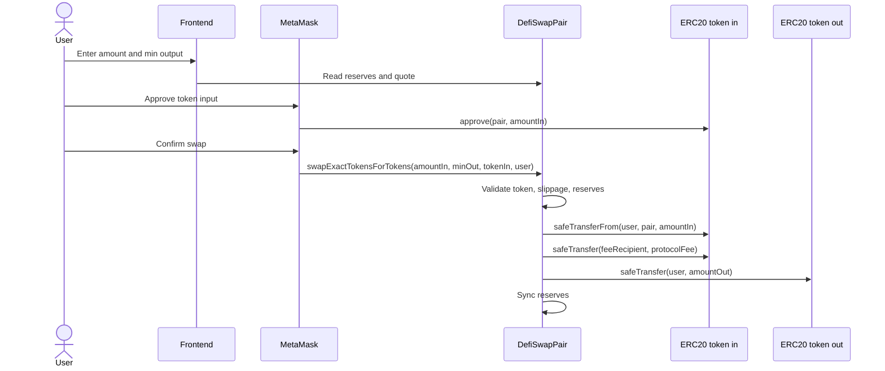
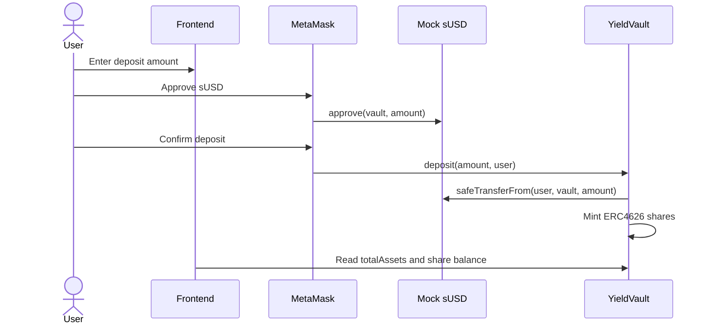
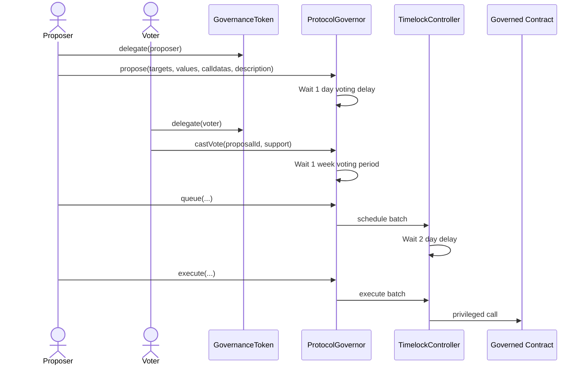
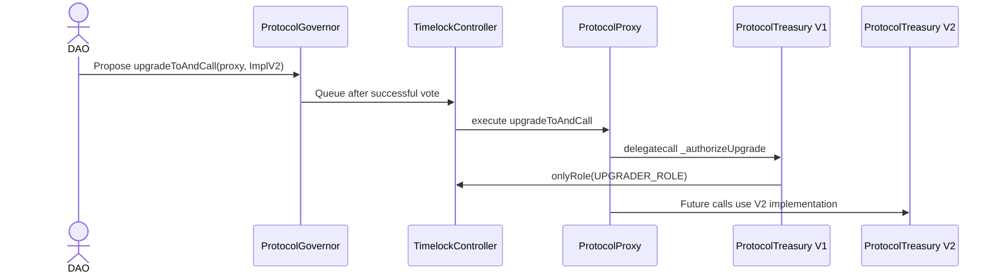
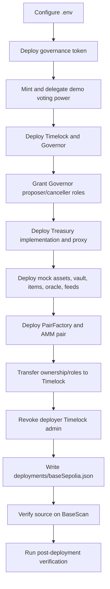

# Architecture & Design Document

## 1. Executive Overview

The project implements **Option A — DeFi Super-App** for the Blockchain Technologies 2 final project. The deployed Base Sepolia protocol combines a governance token, Governor/Timelock DAO, UUPS treasury, constant-product AMM, ERC4626 vault, ERC1155 protocol items, Chainlink-compatible oracle adapter, frontend dApp, and Graph Protocol subgraph.

The protocol is intentionally small enough for a student team to audit and defend, but it still demonstrates production patterns: upgrade isolation through UUPS, deterministic deployments through CREATE2, timelocked administration, SafeERC20 accounting, explicit staleness checks for oracle reads, event indexing, and CI checks for tests, coverage, linting, frontend build, subgraph build, and static analysis.

### Scenario

The selected scenario is a DeFi Super-App:

- Users can hold and delegate governance voting power through `GovernanceToken`.
- Users can swap between deployed mock assets through `DefiSwapPair`.
- Users can deposit mock USDC into `YieldVault` and receive ERC4626 shares.
- DAO proposals pass through `ProtocolGovernor` and `TimelockController`.
- Timelock controls the treasury, vault, factory, pair, oracle, and token ownership.
- Protocol activity is indexed by a subgraph and presented in the frontend.

### Deployed Network

The committed deployment targets **Base Sepolia**, chain id `84532`. Verified contract links are listed in `docs/base-sepolia-deployment.md`, and machine-readable addresses are in `deployments/baseSepolia.json`.

## 2. System Context Diagram

The frontend does not custody funds. It only prepares transactions for the wallet and reads state from Base Sepolia and the subgraph. All privileged protocol changes must go through Governor and Timelock.

## 3. Container / Component Diagram

## 4. Deployed Components

| Component | Address |
| --- | --- |
| Governance token | `0x11Cb8e82cc243Abbb960373E701a10593234A8dA` |
| Timelock | `0x433A20a53036798EEf6E9f99f76fe4D8a334d999` |
| Governor | `0x131B28c5141eff6860312643C44BFEE911AF4A7C` |
| Treasury proxy | `0x517E233f82aCA99855da1868e59c62c053DE1B2B` |
| Treasury implementation | `0xbe2A936b4eE2D9834F45F32bEfe1f5105955F920` |
| Mock sUSD | `0xc57a698eAbb1eE7Fe87C741ea2EC4e860038C069` |
| Mock sWETH | `0x79E1fBC061bE3B20e8a76bf3bc84FD19F4039E56` |
| ERC4626 vault | `0xDBCFA9EC3607e94298070202bF29aCeC5799b6af` |
| ERC1155 items | `0xEDB4203e218795531AC31D1A2bdEc83f8A38A41A` |
| Oracle adapter | `0xd9D6Caa996b8691Ca810545f9Ca04F1fF0Fdf8c4` |
| Pair factory | `0x829aF2859fA5D72b26C54f6467f625a86Ef89B67` |
| AMM pair | `0x45B59F4866A5748721c82db2Cc5149CFc5178dDB` |

## 5. Critical User Flows

### 5.1 AMM Swap

The AMM uses the constant-product formula with a 0.3% input fee. `minAmountOut` protects the user against slippage. `nonReentrant` protects liquidity and swap entry points.

### 5.2 Vault Deposit

The vault inherits OpenZeppelin ERC4626 for share accounting and rounding behavior. State-changing entry points are paused with `Pausable` and guarded with `ReentrancyGuard`.

### 5.3 Governance Proposal Lifecycle

The Timelock is the effective admin. The deployer is not a Timelock admin after deployment. The post-deployment verification script checks this.

### 5.4 UUPS Upgrade

`ProtocolTreasuryV2` adds behavior but no storage variables, so the V1 storage layout is preserved.

## 6. Storage Layout

### 6.1 `GovernanceToken`

The token inherits OpenZeppelin `ERC20`, `ERC20Permit`, `ERC20Votes`, and `Ownable`.

| Storage source | Purpose |
| --- | --- |
| ERC20 | balances, allowances, total supply |
| ERC20Permit / EIP712 | permit domain and nonces |
| ERC20Votes | checkpoints and delegated votes |
| Ownable | owner address |

The contract adds no custom mutable storage except the inherited layout. `MAX_SUPPLY` is a constant.

### 6.2 `ProtocolTreasury`

`ProtocolTreasury` is upgradeable. It uses OpenZeppelin upgradeable modules plus a storage gap.

| Slot area | Source | Purpose |
| --- | --- | --- |
| ERC7201 namespaced storage | `AccessControlUpgradeable` | role admin and memberships |
| ERC7201 namespaced storage | `PausableUpgradeable` | paused flag |
| ERC7201 / UUPS storage | `UUPSUpgradeable` / ERC1967 | implementation upgrade checks |
| Reentrancy storage | `ReentrancyGuard` | entered/not-entered guard |
| `__gap` | `uint256[50]` | reserved future storage |

`ProtocolTreasuryV2` adds no state variables. Therefore, the V1 to V2 upgrade cannot collide with existing storage.

### 6.3 `DefiSwapPair`

| Variable | Type | Purpose |
| --- | --- | --- |
| `token0` | immutable address | sorted token A |
| `token1` | immutable address | sorted token B |
| `feeRecipient` | address | protocol fee receiver |
| `_reserve0` | uint112 | token0 reserves |
| `_reserve1` | uint112 | token1 reserves |
| ERC20 storage | inherited | LP balances, allowances, supply |
| Ownable storage | inherited | AMM admin owner |
| Reentrancy storage | inherited | swap/liquidity guard |

The pair stores reserves as `uint112`, similar to AMM designs that keep reserves compact and guard overflow before updating.

### 6.4 `PairFactory`

| Variable | Type | Purpose |
| --- | --- | --- |
| `getPair` | mapping(address => mapping(address => address)) | token pair lookup in both directions |
| `allPairs` | address[] | pair enumeration |
| `feeRecipient` | address | recipient passed into new pairs |
| Ownable storage | inherited | factory admin |

The factory uses `CREATE` in `createPair` and `CREATE2` in `createPairDeterministic`. `predictPairAddress` uses the same salt derivation as deployment.

### 6.5 `YieldVault`

| Storage source | Purpose |
| --- | --- |
| ERC20 | vault share balances |
| ERC4626 | underlying asset reference and share conversion logic |
| Ownable | owner for pause/yield reporting |
| Pausable | paused flag |
| ReentrancyGuard | deposit/withdraw guard |

OpenZeppelin ERC4626 supplies rounding semantics. The Foundry suite covers deposit, mint, withdraw, redeem, and fuzzed deposit/withdraw/redeem flows.

### 6.6 Other Contracts

| Contract | Storage |
| --- | --- |
| `ProtocolItems` | ERC1155 balances, ERC1155Supply totals, AccessControl roles, Pausable flag |
| `ChainlinkPriceOracle` | `mapping(asset => FeedConfig)` with feed address, staleness window, enabled flag |
| `AssemblyMath` | stateless utility |
| `ProtocolProxy` | ERC1967 implementation/admin slots inherited from OpenZeppelin proxy |

## 7. Trust Assumptions

| Actor | Powers | Risk | Mitigation |
| --- | --- | --- | --- |
| Token holders | Vote on proposals | Whale voting or apathy | Proposal threshold, quorum, public voting period |
| Timelock | Executes successful proposals | Malicious queued proposal after governance capture | 2 day delay gives time to inspect and react |
| Deployer | Initial deployment only | Deployer backdoor | Deployment verification confirms deployer Timelock admin revoked |
| Frontend maintainer | Can change UI defaults | Malicious UI could suggest bad transactions | Contracts enforce auth; addresses documented separately |
| Oracle owner / Timelock | Can set feeds | Bad feed can affect reads | Feed updates are timelocked after deployment |
| Subgraph operator | Can affect indexed UI data | Stale or incomplete indexed view | Critical state can be read directly from contracts |

The protocol assumes Base Sepolia finality and RPC availability for demo purposes. It also assumes users inspect wallet transaction prompts before signing.

## 8. Design Patterns Used

| Pattern | Location | Justification |
| --- | --- | --- |
| Factory | `PairFactory` | Deploys AMM pairs and demonstrates CREATE/CREATE2 |
| Proxy / UUPS | `ProtocolProxy`, `ProtocolTreasury` | Treasury can be upgraded through DAO-controlled UUPS path |
| Checks-Effects-Interactions | `ProtocolTreasury`, `DefiSwapPair` | State updates happen before outbound transfers where relevant |
| Access Control / RBAC | `ProtocolTreasury`, `ProtocolItems`, Ownable contracts | Privileged functions are not open |
| Pausable / Circuit Breaker | `ProtocolTreasury`, `YieldVault`, `ProtocolItems` | Lets DAO stop sensitive flows during incident response |
| Oracle Adapter | `ChainlinkPriceOracle` | Isolates feed interface and staleness validation |
| Timelock | `TimelockController` | Gives users time before privileged changes execute |
| Reentrancy Guard | Treasury, AMM, vault | Protects functions with token/ETH movement |
| State Machine | Governor proposal states | Pending, Active, Succeeded, Queued, Executed lifecycle |

## 9. Architecture Decision Records

### ADR-001: Use Hardhat + Foundry Together

Context: The course prefers Foundry, but the team already had Hardhat deployment and verification scripts.  
Options: Foundry only, Hardhat only, or mixed toolchain.  
Decision: Use Hardhat for deployment/frontend-friendly ABI generation and Foundry for the larger security/coverage suite.  
Consequences: CI installs both Node and Foundry. This adds setup time but improves coverage of requirements.

### ADR-002: Use AMM Instead of Lending Pool

Context: The DeFi primitive requirement allows either AMM or lending.  
Options: Build constant-product AMM or lending with liquidation.  
Decision: Build AMM from scratch.  
Consequences: The team can test invariant `k` behavior, slippage, LP shares, and CREATE2 pair deployment within project scope.

### ADR-003: Use Timelock as Final Admin

Context: Production protocols should not leave privileged power with a deployer.  
Options: Deployer owner, multisig owner, or Timelock owner.  
Decision: Transfer ownership/roles to Timelock and revoke deployer Timelock admin.  
Consequences: Administration is slower, but more defensible for governance and audit.

### ADR-004: Use ERC4626 via OpenZeppelin

Context: ERC4626 rounding behavior is subtle and easy to implement incorrectly.  
Options: Write vault from scratch or extend OpenZeppelin ERC4626.  
Decision: Use OpenZeppelin ERC4626 and test deposit/mint/withdraw/redeem behavior.  
Consequences: The vault is safer and easier to audit, while still satisfying the tokenized vault requirement.

### ADR-005: Use Mock Feeds for Demo Deployment

Context: Real Chainlink feeds may not exist for every mock asset on Base Sepolia.  
Options: Require live feeds only or deploy Chainlink-compatible mocks.  
Decision: Deploy `MockV3Aggregator` when no feed env var is provided.  
Consequences: The oracle integration and staleness logic are demonstrable and testable. Production deployment should replace mocks with official feeds.

### ADR-006: Manual Proposal List in Frontend

Context: OpenZeppelin Governor does not enumerate proposals on-chain.  
Options: Add a custom proposal registry to contracts, rely on subgraph, or configure known IDs.  
Decision: Configure known proposal IDs in `frontend/src/config/proposals.ts` and also index proposals in the subgraph.  
Consequences: The frontend can show a demo proposal immediately. A production UI should use the subgraph as the canonical proposal list.

## 10. Operational Notes

The deployment script is parameterized with environment variables and idempotent for the committed Base Sepolia deployment. Verification scripts check ownership, Governor parameters, Timelock delay, and treasury roles. If redeploying, use a fresh wallet and update `deployments/baseSepolia.json`, frontend contract config, and subgraph addresses together.

## 11. Frontend Architecture

The frontend is intentionally thin. It does not implement business rules that should live in contracts. Instead, it has four responsibilities:

1. Detect the connected wallet and network.
2. Read contract state and present it in a human-readable form.
3. Prepare write transactions for wallet confirmation.
4. Query indexed subgraph data when a `VITE_SUBGRAPH_URL` is configured.

| Frontend module | Responsibility |
| --- | --- |
| `frontend/src/config/contracts.ts` | Base Sepolia contract addresses |
| `frontend/src/config/chains.ts` | Expected chain id and RPC metadata |
| `frontend/src/config/proposals.ts` | Known proposal IDs for Governor UI |
| `frontend/src/hooks/useTokenData.ts` | DSG balance, voting power, delegate |
| `frontend/src/hooks/useProtocolState.ts` | AMM reserves and vault state |
| `frontend/src/hooks/useGovernance.ts` | Proposal state reads |
| `frontend/src/hooks/useSubgraphData.ts` | GraphQL query for indexed data |
| `frontend/src/utils/errors.ts` | Converts raw wallet/RPC errors into readable messages |

The UI supports a useful degraded mode. If the user is disconnected, the dashboard still explains the target network. If the user is on the wrong chain, the network guard asks for Base Sepolia. If the subgraph URL is missing, the subgraph page shows a readable configuration message instead of crashing. This matters during demos because wallet, RPC, and Graph Studio setup are common failure points.

The frontend currently uses MetaMask/injected connector. WalletConnect is not required by the rubric, but it could be added later through wagmi connectors without changing contract code.

## 12. Subgraph Data Model

The subgraph indexes more entities than the minimum requirement. Its goal is to support activity pages and proposal history without forcing the frontend to scan chain logs directly.

| Entity | Source event | Use |
| --- | --- | --- |
| `TokenTransfer` | `GovernanceToken.Transfer` | Governance token movement |
| `DelegateChange` | `GovernanceToken.DelegateChanged` | Delegation history |
| `Proposal` | Governor proposal lifecycle events | Proposal list and status |
| `VoteCast` | Governor vote events | Vote history |
| `Swap` | AMM swap event | Recent swaps |
| `LiquidityPosition` | AMM liquidity events | LP activity summary |
| `VaultDeposit` | ERC4626 deposit event | Vault inflows |
| `VaultWithdraw` | ERC4626 withdraw event | Vault outflows |
| `ItemTransfer` | ERC1155 transfer event | Protocol item movement |

The mapping file intentionally stores immutable historical events separately from mutable aggregate state. For example, `Swap` is immutable because each swap is a historical fact. `LiquidityPosition` is mutable because it aggregates added and removed liquidity for a provider/receiver pair.

## 13. Deployment Lifecycle

The deploy script is designed to avoid manual transcripts. The deployment file is the canonical machine-readable output. The documentation file is the human-readable output with BaseScan links.

## 14. Failure Modes and Recovery

| Failure mode | Expected behavior | Recovery |
| --- | --- | --- |
| User on wrong network | Frontend warns and offers network switch | Switch to Base Sepolia |
| User rejects wallet transaction | UI shows readable rejection message | User retries |
| Insufficient sUSD for vault deposit | Contract or wallet rejects | Mint/test transfer sUSD in demo wallet |
| Subgraph URL missing | UI shows configuration message | Set `VITE_SUBGRAPH_URL` after hosting |
| Oracle feed stale | Oracle read reverts | Timelock updates feed or stale window |
| AMM slippage too high | Swap reverts | User raises minOut tolerance or retries |
| Proposal not active | Vote transaction reverts | Wait until voting delay has elapsed |
| Upgrade proposal malicious | Timelock delay exposes queued action | Token holders/social process can react |

## 15. Mainnet Readiness Gap

This project is a capstone demonstration, not a mainnet launch. Before a production release, the team would need:

- Real asset contracts instead of mock tokens.
- Official Chainlink feeds for each supported asset.
- A decentralized token distribution plan.
- External professional audit.
- Hosted and monitored subgraph endpoint.
- Emergency response plan and multisig procedures.
- More formal frontend transaction simulation.
- Production RPC redundancy.

The current architecture keeps these future changes localized. Replacing mock feeds affects oracle configuration. Replacing mock tokens affects deployment addresses and frontend config. Improving proposal enumeration affects subgraph/frontend, not governance contracts.
